# 라벨링 코스트와 검출 성능을 고려한 딥러닝 기반 PCB 외관 결함 검사 최적화

## 1. 문제 정의

현재 많은 산업 현장에서 육안으로 오류를 검사하는 것을 대체하기 위해 비전 AI를 도입하고 있습니다.특히 반도체 분야에서는 트렌지스터, 웨이퍼, PCB 기판 등의 오류를 탐지하기 위해 여러가지 방식의 모델을 사용하고 있습니다. YOLO 등의 지도학습 방식은 결함을 매우 정확하게 찾아낼 수 있는 방식 중 하나입니다. 불량의 종류까지 완벽하게 분류해 내는 성능을 가지고 있습니다. 그러나 현장에서 이 모델을 사용하려면 수만 장의 불량 데이터를 처리해야 하는 데서 막대한 라벨링 코스트가 발생합니다. 반면 Anomalib같은 정상 데이터로만 학습하는 이상 탐지 방식은 구축하는데 비용은 적게 들지만 불량의 종류를 세밀하게 분류하기는 어렵다는 단점이 있습니다.  

따라서 이 프로젝트는 PCB 결함 데이터를 활용해 전통적인 비전 기법, 지도학습, 비지도학습 모델을 구현하고 어떤 상황에서 어떤 모델을 도입하는 것이 가장 효율적이고 타당한지 정량적 기준을 제시하고자 합니다.

## 2. 데이터셋의 구조와 분할

### 2.1 DeepPCB 데이터셋

DeepPCB[1]는 PCB 표면에 발생하는 미세 결함을 탐지하기 위해 만들어진 오픈 데이터셋입니다. 데이터는 총 1500개의 이미지 페어로 구성되어 있습니다. 이미지 페어는 정상 템플릿 이미지 한 장과 검사 대상 이미지 한 장으로 구성되어 있습니다. 이미지는 모두 640x640 해상도의 흑백 이미지입니다. 이미지가 포함할 수 있는 결함에는 아래의 6가지 종류가 있습니다.

- 전기가 통하지 않아야 할 두 지점이 의도치 않게 직접 연결 (short)
- 회로나 연결 부위가 끊어짐 (open)
- 절단 면이 매끄럽지 못해 발생하는 뜯김 및 돌출 현상 (mouse bite)
- 회로나 패드의 가장자리에 불필요하게 튀어 나온 돌기 (spur)
- 크랙(crack), 보이드(void), 박리(delamination) 등의 구리 관련 결함 (copper)
- 기판 표면이나 도금층에 바늘로 찌른 듯한 미세한 구멍이 뚫리는 불량 (pin-hole)

### 2.2 데이터셋 분할

데이터셋에서 권장하는 기준을 따라서 전체 1500장 중 1000장은 Train, 500장은 Test로 분할합니다. 데이터의 수가 상대적으로 적으므로 Validation은 학습 중 Train 데이터의 일부를 할당하거나 Test 데이터의 일부를 사용합니다. Yolo 계열 모델을 사용할 때는 1,000장의 검사 대상 이미지와 결함의 위치/종류가 적힌 Bounding Box 라벨링 텍스트 파일을 모두 사용하여 학습합니다. Anomalib 계열 모델을 사용할 때는 불량 데이터와 라벨링 정보는 전혀 사용하지 않습니다. 오직 1,000쌍의 데이터 중 정상 템플릿 이미지 1,000장만 사용하여 정상 패턴을 학습합니다.

## 3. 모델의 구조와 학습 전략

이 프로젝트에서는 지도학습 모델로 Ultralytics의 YOLO11s를, 비지도학습 모델로 Anomalib의 PatchCore를 사용했습니다. 또한 성능 비교군 형성을 위해 이미지 차분 방식의 고전 영상 처리 방식을 구현했습니다.

### 3.1 YOLO11s (You Only Look Once v11 - Small)


▲ YOLO11s 모델 구조 이미지[2]

Ultralytics의 YOLO11s[3]는 이미지를 한 번 쳐다보고 객체의 종류와 위치를 동시에 찾아내는 1-Stage 객체 탐지 모델의 일종입니다. Small 버전은 파라미터 수를 줄여 속도와 정확도의 밸런스를 맞춘 경량화 모델입니다.

 ● 구조 설명: 크게 Backbone, Neck, Head 3가지 부분으로 나뉩니다.

- Backbone (백본): 특징 추출
  - 역할: PCB 기판 사진으로부터 질감, 선, 모서리 등 다양한 Feature를 뽑아내는 역할을 합니다.
  - 구조: 여러 겹의 CNN 으로 이루어져 있습니다. 이미지가 깊은 층을 통과할수록 해상도는 작아지지만 더 깊고 함축적인 의미를 갖는 Feature Map으로 변환됩니다.
  
- Neck (넥): 특징 결합
  - 역할: Backbone에서 뽑아낸 다양한 크기의 특징들을 서로 섞어서 정보의 손실을 막고 작은 객체도 잘 찾도록 돕습니다.
  - 작동 방식: PANet, FPN 구조를 활용하여 얕은 층에서 뽑은 디테일한 정보와 깊은 층에서 뽑은 요약된 정보를 Top-down 했다가 Bottom-up 하면서 연결하여 합쳐줍니다.
  
- Head (헤드): 예측
  - 역할: Neck에서 잘 정제해 준 특징 맵을 바탕으로 최종 결과값을 출력합니다.
  - 출력: 이미지를 그리드로 나누고, 각 위치마다 바운딩 박스의 좌표(x, y, w, h), 객체가 있을 확률(Objectness Score), 그리고 그것이 어떠한 불량에 속할지 그 확률(Class Probability)을 동시에 계산해 냅니다.

### 3.2 PatchCore

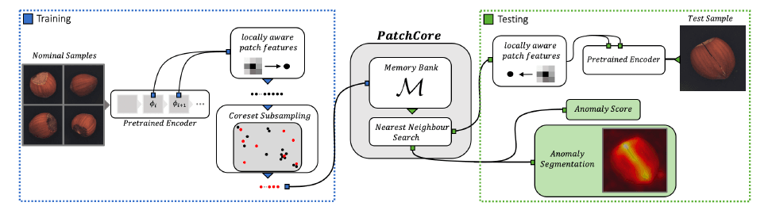
▲ PatchCore 아키텍처 구조 이미지[4]

Anomalib의 PatchCore[5]는 정상 데이터의 특징을 외워둔 뒤, 새로운 이미지가 들어왔을 때 외운 것과 얼마나 다른지 계산하여 불량을 탐지하는 이상 탐지 모델입니다.

 ● 구조 설명

- Backbone: 특징 추출
  - ImageNet으로 사전 학습된 모델을 가져와 씁니다.(backbone="wide_resnet50_2")
  - 모델의 얇은 층이나 너무 깊은 층은 버리고, 중간 층의 특징 맵만 뽑아서 사용합니다.
  
- Locally Aware Patch Features: 패치 특징 생성
  - 뽑아낸 특징 맵의 한 픽셀만 보지 않고, 주변 픽셀들을 Patch(그룹화)하여 공간적인 Context(맥락)를 유지합니다.
  
- Coreset Subsampling: 메모리 뱅크
  - Coreset 알고리즘을 사용하여 정보의 손실을 최소화하면서 중복되는 특징은 버리고 핵심적인 정상 패치들만 남깁니다. (coreset_sampling_ratio=0.1은 전체 데이터의 10%만 핵심으로 남기겠다는 뜻)
  - 이러한 핵심적인 정상 패치들이 모이는 저장소를 Memory Bank라고 부릅니다.

- Anomaly Scoring: KNN 기반 이상 점수 산출
  - 테스트 이미지가 들어오면 똑같이 패치를 뽑은 뒤 KNN(K-Nearest Neighbors) 방식으로 메모리 뱅크 안의 정상 패치들과 거리를 비교합니다.
  - 가장 가까운 정상 패치와의 거리가 멀다면, 처음 보는 패턴이라고 판단해 높은 Anomaly Score를 부여합니다.

### 3.3 Image Subtraction (이미지 차분 - OpenCV)

OpenCV[6]를 이용해서 이미지 차분 방식의 고전 영상 처리 방식을 구현했습니다. 정상 템플릿과 검사 대상 이미지를 픽셀 단위로 비교합니다.

 ● 파이프라인 설명

- Preprocessing
  - 연산을 빠르게 하기 위해 컬러 이미지를 흑백으로 바꿉니다.
  - Gaussian Blur 등을 사용해 아주 미세한 조명 차이나 먼지 같은 불필요한 노이즈를 부드럽게 뭉개줍니다.

- Image Registration / Alignment
  - 정상본과 검사본의 위치나 각도가 1픽셀이라도 어긋나 있으면 기판 전체가 불량으로 나오게 됩니다.
  - 그래서 ORB, SIFT 같은 알고리즘을 사용해 두 이미지의 주요 특징점을 찾은 뒤, 검사 이미지를 정상 템플릿의 위치와 각도에 완벽하게 일치하도록 덮어씌웁니다.

- Absolute Difference
  - 거리를 구하는 공식 $\textit{g(x,y)}= |\textit{f}_{normal}(x,y)-\textit{f}_{inspection}(x,y)|$을 적용합니다. (cv2.absdiff)
  - 똑같은 부분은 0(검은색)이 되고, 달라진 불량 부분은 0보다 큰 값(회색~흰색)을 가지게 됩니다.

- Thresholding
  - 차분 결과에서 희미한 값은 전부 0(검정)으로 날려버리고, 임계값을 넘는 확실한 차이만 255(흰색)로 만들어 명확한 흑백 지도로 만듭니다.

- Morphological Operations
  - 이진화 후에도 흩날리는 1픽셀짜리 노이즈들이 남아있을 수 있습니다.
  - 따라서 Opening 연산으로 점들을 지우고, Closing 연산으로 끊어진 결함들을 하나의 덩어리로 이어줍니다.

- Contour Detection
  - 최종적으로 살아남은 흰색 덩어리들의 외곽선을 찾아 직사각형 바운딩 박스를 쳐줍니다.

### 3.4 학습 전략

두 모델 모두 Transfer Learning 범주에 있는 학습 방법을 사용하지만 두 모델의 구조가 다른 만큼 다른 방식을 채택합니다.

1. **YOLO (fine-tuning)**:  
   일반 사물 이미지인 COCO 데이터셋으로 pre-trained된 가중치를 가져옵니다. 이 모델의 Classigier와 Regressor를 PCB 데이터의 6가지 클래스에 맞게 수정한 뒤 fine-tuning 기법을 사용해서 모델 전체의 가중치를 미세하게 업데이트하며 학습하는 방법을 사용합니다.

   - epochs: 50 / early stopping
   - batch_size: 16 ~ 24
   - imgsz: 640
   - lr0: 1e-4 ~ 1e-2
  
2. **Anomalib PatchCore (Feature Extraction & Memory Bank)**:  
   ImageNet으로 사전 학습된 ResNet 계열의 가중치를 가져옵니다. 이 모델의 가중치는 업데이트 하지 않습니다. 대신 사전 학습된 모델을 Feature Extractor로 사용하여 정상 PCB 이미지들의 Feature vector를 추출한 뒤 이것을 Memory bank에 저장해 두는 방식으로 학습을 대신합니다. 검사 이미지가 들어오면 Memory bank의 정상 패턴과의 distance를 비교하는 방식으로 불량을 탐지합니다.

   - 가중치: Freeze
   - backbone: WideResNet50
   - coreset_sampling_ratio: 0.1 이상
  
3. **Image Subtraction(이미지 차분)**:  
   이 방식은 학습이 필요 없습니다. Alignment 문제나 False Positive 문제가 있기 때문에 미세한 노이즈에 약하다는 한계점을 명확히 제시할 수 있습니다. 그렇기에 딥러닝 모델을 왜 써야하는가에 대한 당위성도 제공할 수 있습니다. DeepPCB 데이터셋이 정상 이미지와 검사 대상 이미지를 이미지 페어를 통해 제공한다는 점을 활용해서 아래와 같은 방식으로 OpenCV를 활용하여 구현합니다.

   - 차분 연산(cv2.absdiff) -> 이진화(cv2.threshold) -> 노이즈 제거(cv2.erode / cv2.dilate)
   - 결과는 cv2.findContour로 결함의 위치 또는 윤곽선을 표시하여 시각화
   - 성능 향상을 위해 cv2.threshold의 수치를 조절

## 4. 성능 비교

공정한 비교를 위해 모든 모델은 동일한 GPU 연산 환경에서 실행되었으며, 각 이미지당 소요되는 처리 시간과 검출된 Bounding Box 데이터를 수집하여 Ground Truth와 비교 대조하는 스크립트를 자체적으로 구현하여 성능을 측정했습니다.

### 4.1 성능 측정 기준

생산 라인에 투입되는 딥러닝 모델은 정확도뿐만 아니라 실시간 처리 능력도 매우 중요하므로, 다음과 같은 정량적 지표를 종합적으로 평가 기준으로 삼았습니다.

- 평균 추론 시간 (Mean Inference Time, ms): 이미지 1장을 입력받아 결함 위치를 출력하기까지 걸리는 평균 시간.
- 초당 처리 속도 (Throughput, FPS): 1초당 검사할 수 있는 이미지의 장 수.
- 결함 탐지 정확도 (Detection Accuracy, %): 전체 예측 및 정답 집합 중 정확히 맞춘 비율. $\frac{TP}{TP + FP + FN} \times 100$ 으로 산출.
- True Positive (TP, 정상 검출): 모델이 불량으로 판정한 것 중, 실제로 불량인 개수.
- False Positive (FP, 과검/오탐): 정상 영역을 불량이라고 잘못 판정한 개수.
- False Negative (FN, 미검/놓침): 실제 불량인데 모델이 정상으로 판정하여 놓친 개수.

### 4.2 성능 비교 결과

| 비교 항목 | YOLO11s* | OpenCV** | PatchCore |
| :--- | ---: | ---: | ---: |
| 방식 | Object Detection | Image Subtraction | Feature Extraction |
| 평균 추론 시간 | 14.13ms | 1.30ms | 125.04 ms |
| 초당 처리 속도 | 70.79 FPS | 771.63 FPS | 8.00 FPS |
| 결함 탐지 정확도 | 93.51 % | 24.63 % | 0.00 % |
| True Positive | 1960 | 1197 | 0 |
| False Positive | 84 | 2848 | 300 |
| False Negative | 52 | 815 | 2012 |

*YOLO11s parameters: batch size = 24, lr0 = 1e-3  
**OpenCV parameters: threshold = 50  

## 5. 결과 분석

### 5.1 YOLO 모델의 압도적 성능

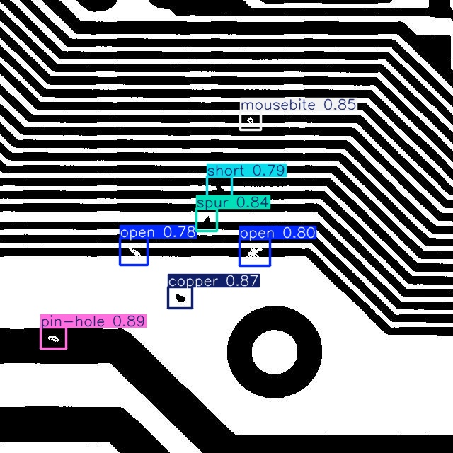

실험 결과 YOLO11s 모델이 batch size = 24, lr0 = 1e-3일 때 정확도와 속도 모든 면에서 가장 압도적인 성능을 보였습니다.

- 결함 Feature의 직접 학습: YOLO는 학습 단계에서 labels 디렉토리의 txt 파일(결함의 x, y, w, h 정답지)을 직접 읽어들입니다. 모델의 Backbone 신경망은 정상적인 회로 패턴(배경)은 무시하고, 'Open', 'Short', 'Mouse-byte'와 같은 결함 고유의 시각적 특징만을 집중적으로 추출하도록 가중치를 업데이트합니다.
- 배경 변화에 대한 강건함: 결함의 모양 자체를 학습했기 때문에, 테스트 이미지의 기판 위치가 템플릿과 몇 픽셀 틀어져 있거나 조명이 달라져도 유연하게 결함을 찾아냅니다.
- 1-Stage 구조의 고속 연산: YOLO는 이미지를 한 번 통과시키는 것만으로 분류와 위치 탐지를 동시에 수행하는 Head 구조를 가집니다. 이로 인해 초당 70 프레임의 실시간 추론이 가능해졌습니다.

### 5.2 이미지 차분 방식의 성능 저하 원인

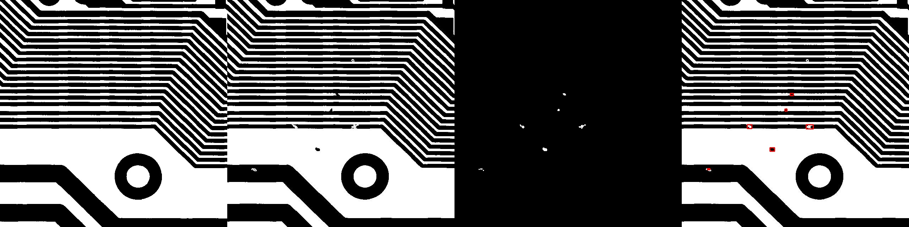

전통적인 영상 처리 방식인 OpenCV 기반의 이미지 차분법은 절반 이하의 정확도와 매우 높은 FP 수치를 기록했습니다. 이 알고리즘의 핵심은 템플릿 이미지(_temp)와 검사 이미지(_test)의 위치를 완벽하게 맞춘 뒤 cv2.absdiff() 함수를 통해 픽셀의 차이를 계산하는 것입니다. 그러나 PCB와 같이 마이크로미터 단위의 정밀한 패턴에서는 ORB나 SIFT 같은 알고리즘으로 위치를 정합하더라도 1~2픽셀의 미세한 오차가 발생합니다.  
이러한 1~2픽셀의 오차는 cv2.absdiff() 연산 시 회로선의 경계면 전체를 차이값으로 인식하게 만듭니다. 결과적으로 cv2.threshold()를 거친 후 얇은 선 형태의 노이즈들이 무수히 쏟아지며, 이를 모두 결함으로 오탐하게 되는 치명적인 단점을 드러냈습니다.

### 5.3 PatchCore의 구조적 한계점

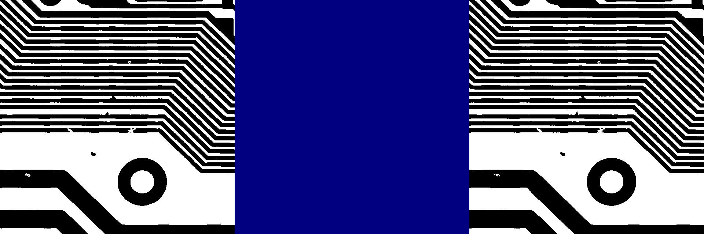

가장 최신에 가까운 방식임에도 불구하고 PatchCore 는 TP 0개, 정확도 0%라는 참담한 결과를 냈으며, 기판 전체를 불량으로 인식하는 현상이 발생했습니다. 이는 모델이 나빠서가 아니라, 알고리즘의 설계 철학과 DeepPCB 데이터셋의 특성이 완전히 상충하기 때문에 발생한 현상입니다.  
DeepPCB 데이터는 반드시 원본 도면(_temp)과 검사본(_test)을 1:1로 짝지어 비교해야만 불량을 정의할 수 있는 '상대 평가' 데이터셋입니다. 하지만 Patchcore는 학습 시 입력된 모든 정상 기판들의 Patch를 하나의 거대한 Memory Bank에 압축하여 저장합니다. 테스트 시, 모델은 1:1 비교를 수행하는 것이 아니라 이 기판 패턴이 내 메모리 뱅크 어딘가에 존재하는가를 묻습니다. 여러 종류의 기판 도면이 뒤섞인 상태에서, 미세한 회로선의 위치 변화는 모델에게 '처음 보는 거대한 이상 패턴'으로 인식되며, 결국 정상적인 회로 선들까지 모두 결함으로 처리해 버리는 구조적 한계를 확인하였습니다.

## 6. 결론

### 6.1 실무적 도입을 위한 YOLO 모델의 타당성

성능 지표뿐만 아니라 실제 공정 도입을 위한 정성적 수치 및 비용(Cost) 측면을 고려했을 때, 본 프로젝트의 최종 솔루션으로 YOLO 모델을 채택하는 것이 가장 타당하다고 생각합니다. YOLO11s는 경량화된 구조로 저비용의 Edge GPU 기기에서도 실시간 구동이 가능하다는 사실을 확인했습니다. 또한 YOLO는 데이터만 추가하여 Fine-tuning하면 되므로 확장성이 매우 뛰어납니다. 따라서 정확도, 처리 속도, 그리고 실무 적용을 위한 총소유비용(TCO)을 종합적으로 평가할 때 YOLO 모델이 최적의 대안입니다.

### 6.2 향후 연구 과제

이 프로젝트를 통해 PatchCore의 글로벌 특징 비교 방식이 PCB 결함 검사에 부적합함을 확인하였습니다. 하지만 실제 산업 현장에서는 결함의 종류를 미리 다 알 수 없기 때문에 정상 데이터만으로 불량을 잡는 이상 탐지 기법이 반드시 필요한 경우가 있습니다. 따라서 향후 연구 과제로는 1:1 참조(Reference)가 가능한 구조, 즉 정상 템플릿 영상과 검사 영상을 동시에 모델에 입력하여 두 이미지 간의 차이를 딥러닝 공간 상에서 계산하는 샴 네트워크(Siamese Network) 구조의 이상 탐지 모델 도입을 제안합니다. 이를 통해 공간적 오차에 강건하면서도 1:1 비교 검사가 가능한 새로운 결함 검출 시스템을 구축할 수 있을 것으로 기대합니다.

## 부록

### 프로젝트 구조

```plaintext
PCB_Defect_Inspection/
│
├── data/                       # 데이터셋 폴더
│   ├── raw/                    # Github에서 다운받은 원본 DeepPCB 데이터
│   ├── yolo_format/            # YOLO 학습을 위해 변환된 데이터 (images, labels)
│   └── anomalib_format/        # PatchCore 학습을 위해 변환된 데이터 (normal, abnormal)
├── logs/                       # 학습 로그 파일들
│   └── ...
├── models/                     # PatchCore 파일들
│   └── ...
├── runs/                       # Yolo 파일들
│   └── ...
├── scripts/                    # 실행 가능한 파이썬 스크립트 모음
│   ├── 01_preprocess.py        # 원본 데이터를 YOLO/Anomalib 포맷으로 나누는 코드
│   ├── 02_run_opencv.py        # 고전 비전 베이스라인 실행 코드  
│   ├── 03_train_yolo.py        # YOLO 학습 스크립트
│   ├── 04_train_anomalib.py    # Anomalib 학습 스크립트
│   └── ...                     # 나머지는 시각화 코드
├── results/                    # 결과 시각화 이미지 저장소
│   └── ...
├── images/                     # 보고서 이미지 자료 
│   └── ...
├── requirements.txt            # 필요한 라이브러리 목록
└── README.md                   # 프로젝트 보고서

github 주소: https://github.com/davidots429/ComputerVision2026
```

### 학습 log

학습 로그 파일은 github 저장소에 업로드 되어있습니다. 이곳에서는 스크린샷을 첨부합니다.

전처리

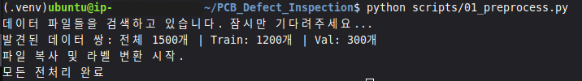

OpenCV

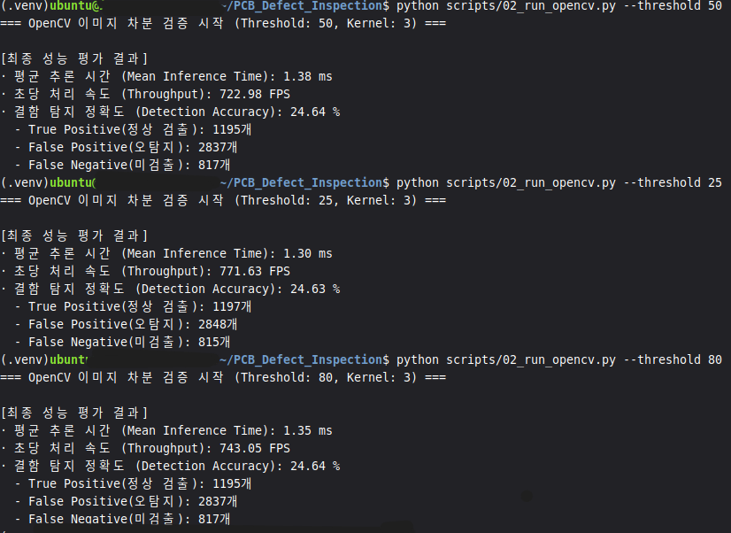

YOLO11s (batch size = 16, lr0 = 1e-2)

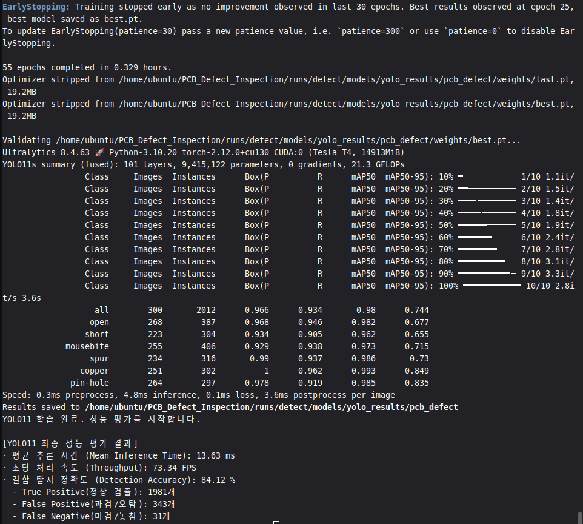

YOLO11s (batch size = 24, lr0 = 1e-2)

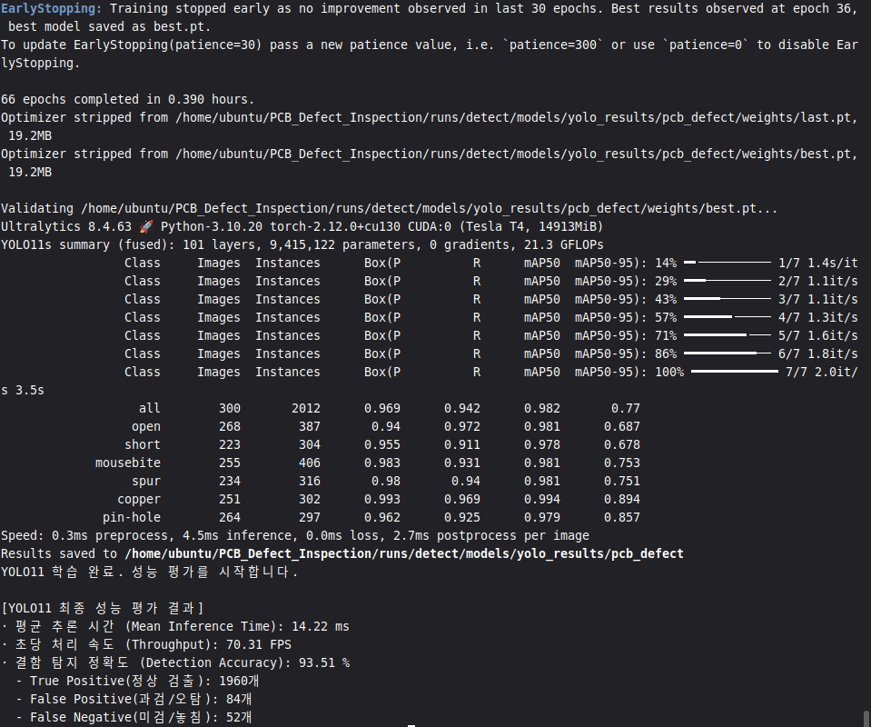

YOLO11s (batch size = 24, lr0 = 1e-3)


YOLO11s (batch size = 24, lr0 = 1e-4)

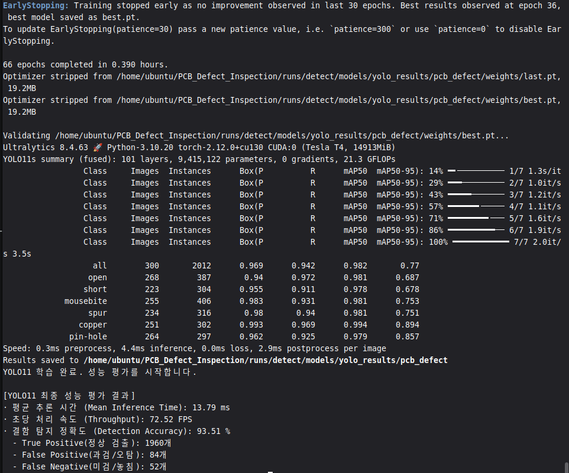

PatchCore

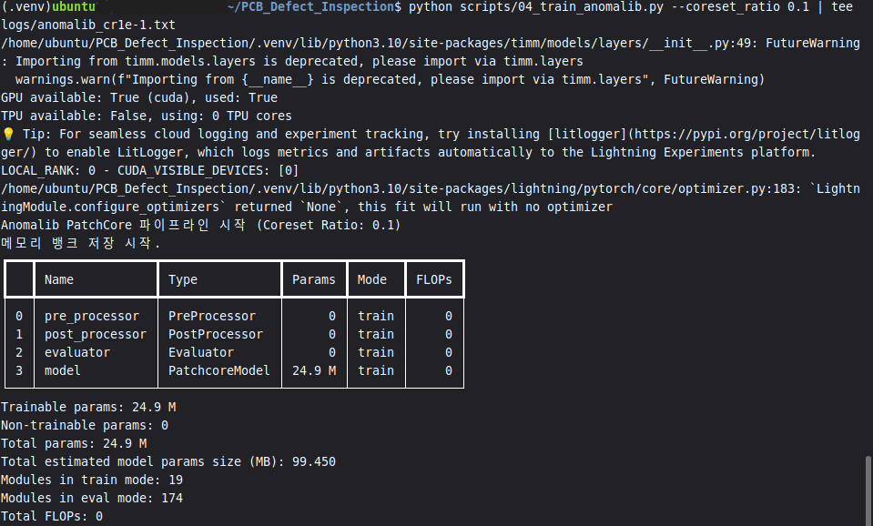
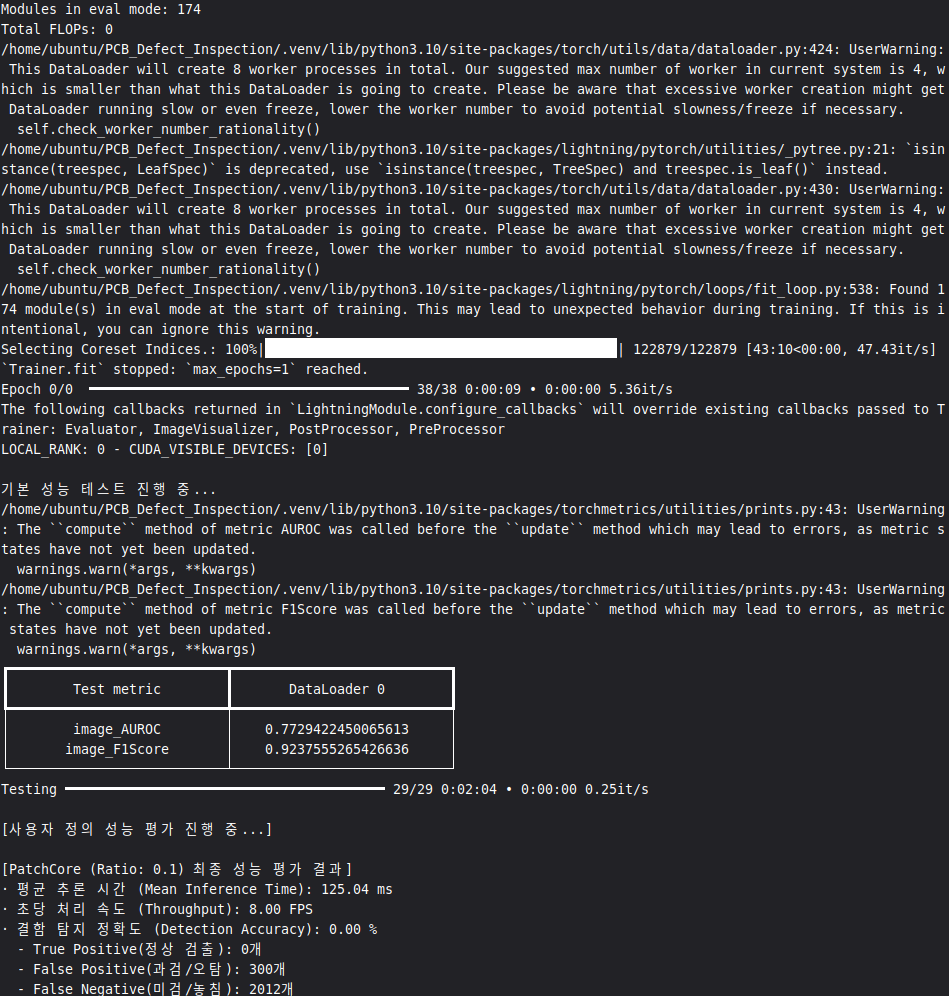

시각화

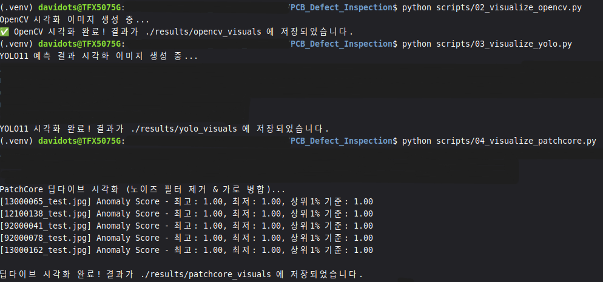

### 참고 문헌 및 출처

이 프로젝트에서는 ultralytics의 소프트웨어인 YOLO11s를 사용했습니다.

[1] 데이터셋: DeepPCB [https://github.com/tangsanli5201/DeepPCB](https://github.com/tangsanli5201/DeepPCB)  
[2] YOLO11 구조 image : [https://www.researchgate.net/figure/The-model-structure-of-YOLO11s_fig4_396730982](https://www.researchgate.net/figure/The-model-structure-of-YOLO11s_fig4_396730982)  
[3] Glenn Jocher, & Jing Qiu (2024). Ultralytics YOLO11 (Version 11.0.0) [Computer software]. Available: [https://github.com/ultralytics/ultralytics](https://github.com/ultralytics/ultralytics)  
[4] [CVPR 2022] PatchCore : Towards Total Recall in Industrial Anomaly Detection  
[5] PatchCore : [https://anomalib.readthedocs.io/en/v2.0.0/markdown/guides/reference/models/image/patchcore.html](https://anomalib.readthedocs.io/en/v2.0.0/markdown/guides/reference/models/image/patchcore.html)  
[6] OpenCV : [https://github.com/opencv/opencv](https://github.com/opencv/opencv)  
